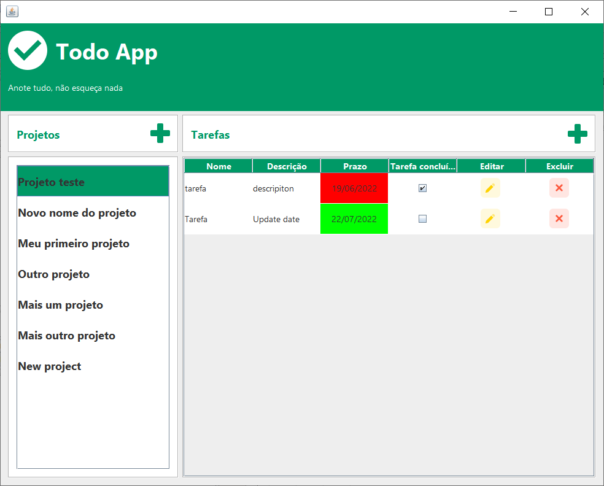
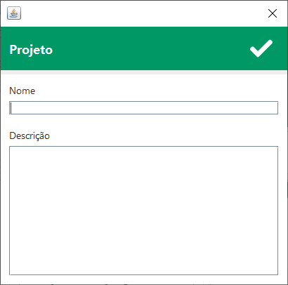
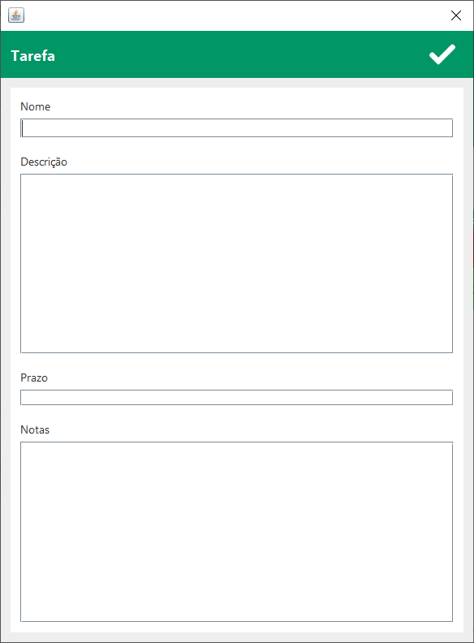

# TodoApp

Projeto "TodoApp" criado durante o curso de lógica de programação e algoritmos III
 realizado no programa start da empresa Capgemini.

Basicamente foi criado um programa de gerenciamento de projetos/tarefas com interface gráfica
na liguagem java e com conexão ao banco de dados MySQL, seguindo os padrões do CRUD e MVC.

## ScreenShots

